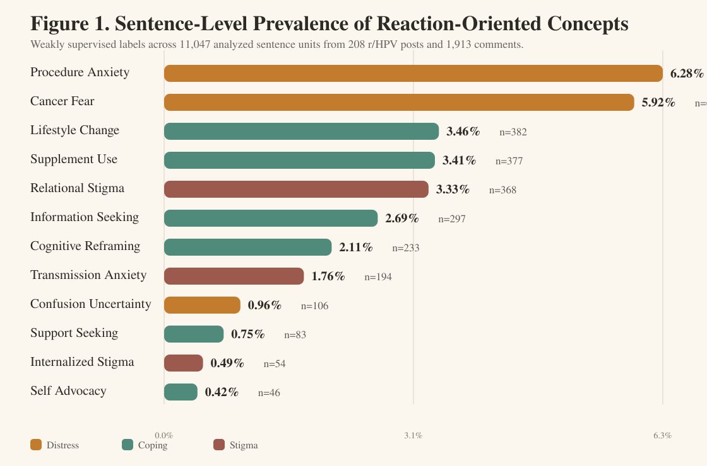
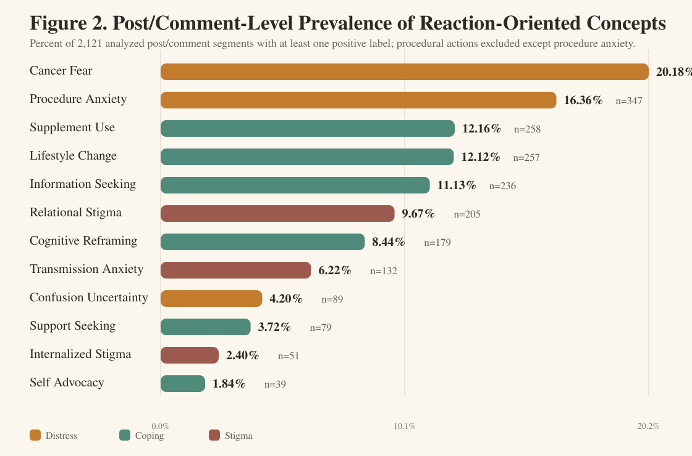

# Reddit HPV Online Forum Preliminary Analysis

This repository contains a public, aggregate reporting package for a preliminary qualitative NLP analysis of recent `r/HPV` Reddit discussions describing HPV-positive or abnormal cervical-screening experiences.

## Analysis Version

- Source analysis folder: `reddit_hpv_modern_proposal_pipeline_v2__hpv_abnormal_or_positive_237posts`
- Search query: `(abnormal or positive)`
- Threads retrieved: 237
- Cervical-screening relevant threads: 224
- Final personal narrative sample after excluding resource/FAQ-style posts: 208 original posts
- Analyzed comments: 1,913
- Sentence units: 11,047
- Post/comment units: 2,121

## Contents

- `figures/`: publication-ready prevalence figures, including GitHub-renderable SVG versions
- `tables/`: aggregate prevalence and calibration tables
- `docs/`: methods text and preliminary write-up with selected short exemplar excerpts
- `src/`: reproducible Python pipeline used to generate the analysis
- `run_summary.json`: analysis metadata
- `requirements.txt`: Python package requirements

## Figures

## Privacy and Data Availability

This public release intentionally excludes raw Reddit thread/comment datasets and row-level sentence prediction files because the source material concerns sensitive health experiences. The released artifacts are limited to aggregate tables, figures, methodology, code, and a small number of short exemplar excerpts already used in the preliminary analysis narrative.

Researchers seeking to reproduce the analysis should use the provided pipeline against newly collected data in accordance with Reddit's terms, applicable institutional guidance, and ethical handling practices for online health forum content.

## DOI

This repository includes `.zenodo.json` and `CITATION.cff` metadata so a DOI can be minted through Zenodo after the repository is uploaded to GitHub and archived as a release.

## Suggested Citation

See `CITATION.cff`. Update the creator names and ORCID fields before DOI minting if a formal citation is required.
